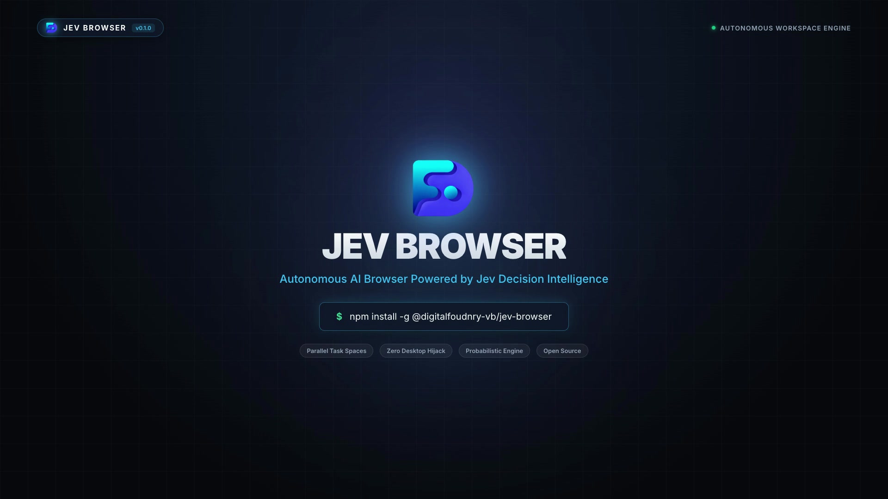

<div align="center">


# Jev Browser

### *El navegador más rápido para que los agentes de IA ejecuten automatización web*

Creado por **[digitalfoundry.ai](https://digitalfoundry.ai/)**

---

[English](README.md) · [简体中文](README.zh-CN.md) · [日本語](README.ja.md) · [한국어](README.ko.md) · [Português](README.pt.md) · **Español** · [Français](README.fr.md) · [Italiano](README.it.md) · [Русский](README.ru.md)

</div>

---

**Jev Browser** es un navegador donde usted y sus agentes de IA trabajan en paralelo. Sus agentes ejecutan sus tareas web en sus propios Spaces, espacios de trabajo aislados dentro del mismo navegador, mientras usted continúa navegando en el suyo, por lo que ningún agente toma el control de su pantalla o ratón. Y la automatización termina mucho más rápido, consumiendo menos tokens.

Las herramientas existentes como browser-use y agent-browser son simples puentes externos hacia el navegador: necesitan una instancia separada, los datos de navegación rara vez se transfieren intactos, la conexión es inestable y usted y el agente terminan compitiendo por el control. Jev Browser es un navegador diseñado desde el inicio para ser compartido sin fricción.

---

## Demostración (Demo)

<div align="center">

[](brag-output/brag.mp4)

*🎬 **[Ver el video de demostración oficial de 20s (MP4)](brag-output/brag.mp4)** — Espacios de Tareas Paralelos Autónomos impulsados por Inteligencia de Decisión Jev*

</div>

---

## Inicio Rápido (Quick Start)

Jev Browser funciona en macOS hoy, versión beta cerrada para Windows muy pronto, y Linux en el mapa de ruta.

### 1. Instalación

```bash
# Instalador directo en una línea para macOS
curl -fsSL https://raw.githubusercontent.com/digitalfoudnry-vb/JevBrowser/main/scripts/install-mac.sh | bash
```

O agregue la habilidad mediante npx:
```bash
npx skills add digitalfoudnry-vb/jev-browser
```

O pídale a su agente que lo configure:
```text
Set up Jev Browser for me: https://github.com/digitalfoudnry-vb/JevBrowser
Read `skills/jev-browser/references/setup.md` and follow the steps to install Jev Browser.
```

---

### 2. Ejecute su primera tarea

```bash
jev-browser "follow @digitalfoundry on x.com for me" https://x.com
```

---

## Aspectos Destacados

- **Basado en código, no en CLI**: Ejecución de JavaScript en la página en un solo paso, ahorrando tokens y acelerando flujos complejos.
- **Espacios dedicados y aislados para cada agente**: Ningún agente interferirá con sus pestañas ni su ratón.
- **La instantánea semántica (Snapshot) más sólida del mercado**: Procesa con precisión iframes profundamente anidados sin alucinaciones.
- **Acumulación de experiencia (Jev Intelligence)**: Optimiza rutas de navegación recurrentes haciéndolas hasta 5 veces más rápidas.

---

## Licencia (License)

Licencia MIT — consulte [LICENSE](LICENSE) y [NOTICE](NOTICE.md).
Creado por **[digitalfoundry.ai](https://digitalfoundry.ai/)**.
