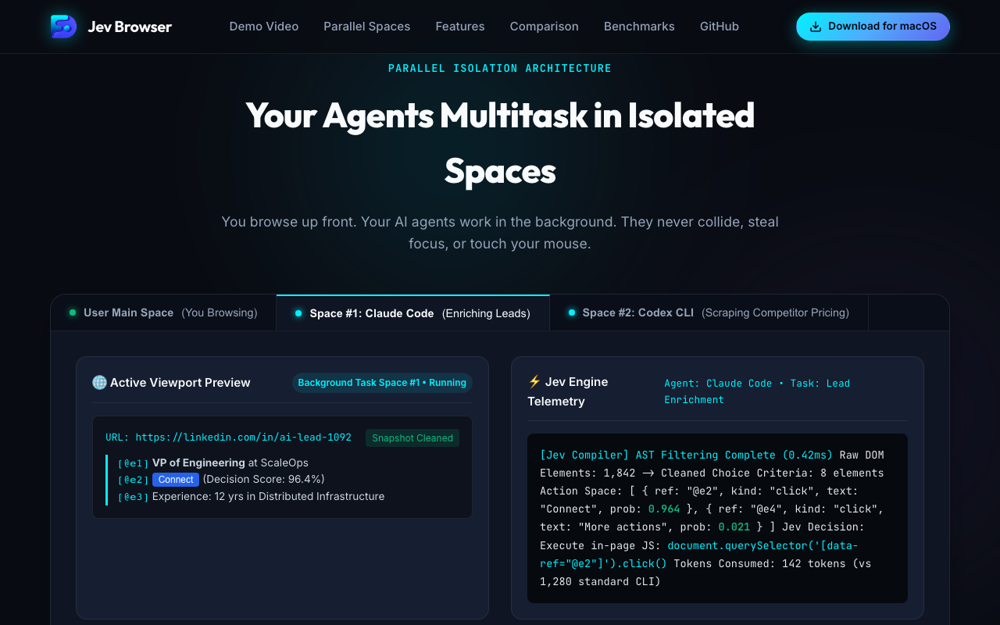

<div align="center">


# Jev Browser

### *The fastest browser for AI agents to run web automation*

Created by **[digitalfoundry.ai](https://digitalfoundry.ai/)**

---

**English** · [简体中文](README.zh-CN.md) · [日本語](README.ja.md) · [한국어](README.ko.md) · [Português](README.pt.md) · [Español](README.es.md) · [Français](README.fr.md) · [Italiano](README.it.md) · [Русский](README.ru.md)

</div>

---

**Jev Browser** is a browser where you and your AI agents work in parallel. Your agents run their browser tasks in their own Spaces, isolated workspaces inside the same browser, while you keep browsing in yours, so no agent ever takes the browser away from you. And the automation itself finishes faster, on fewer tokens.

Existing tools like browser-use and agent-browser are a bridge to the browser, not a browser of their own: they need a separate one to drive, your browser data rarely carries over intact, the connection is unstable, and you and the agent end up fighting over control of the browser. Jev Browser is one browser designed from the start for the two of you to share. No extra setup, and the agent can always reach your real logins and tabs through `jev-browser`.

---

## Demo

<div align="center">

[](brag-output/brag.mp4)

*🎬 **[Watch the 20s Launch Demo Video (MP4)](brag-output/brag.mp4)** — Autonomous Parallel Task Spaces powered by Jev Decision Intelligence*

</div>

---

## Quick Start

Jev Browser runs on macOS today, a Windows closed beta is coming soon, and Linux is on the [roadmap](https://digitalfoundry.ai/roadmap).

### 1. Install

Pick whichever fits your flow.

#### 1.1 Download the macOS app

Download the native macOS app bundle, then open it to install. Jev Browser automatically registers the `jev-browser` skill to every agent's skills directory on your machine:

```bash
# Direct one-line macOS installer
curl -fsSL https://raw.githubusercontent.com/digitalfoudnry-vb/JevBrowser/main/scripts/install-mac.sh | bash
```

Alternatively, build the macOS `.app` directly from source:
```bash
git clone https://github.com/digitalfoudnry-vb/JevBrowser.git
cd JevBrowser
bash scripts/build-macos-app.sh
```

#### 1.2 Add the skill with npx

Install just the `jev-browser` skill into your agent's environment:

```bash
npx skills add digitalfoudnry-vb/jev-browser
```

The first time your agent runs a browser task, it walks you through installing the Jev Browser runtime.

#### 1.3 Let your agent set it up

Paste this prompt directly into your agent (Claude Code, Codex, Cursor, Hermes, or OpenClaw):

```text
Set up Jev Browser for me: https://github.com/digitalfoudnry-vb/JevBrowser
Read `skills/jev-browser/references/setup.md` and follow the steps to install Jev Browser.
```

On first launch, Jev Browser asks one question: whether to migrate your Chrome data. Say yes and your agent inherits your existing logins, cookies, extensions, and bookmarks.

---

### 2. Try your first task

In your agent CLI, type `/jev-browser` followed by a space, then describe what you want in plain language:

```bash
jev-browser "follow @digitalfoundry on x.com for me" https://x.com
```

Or invoke the skill directly in your agent:

```text
/jev-browser Find the top 3 trending GitHub repositories in artificial intelligence and extract their key contributors
```

Your browsing data, cookies, and everything else the browser holds stay on your device. Jev Browser keeps data collection deliberately narrow: simple product signals, like whether you've set Jev Browser as your default browser.

---

### 3. Run the Autonomous Automation Demo

Try an immediate end-to-end task space automation with live AST snapshotting and in-page execution:

```bash
npm run demo:automation
```

This initializes an isolated task space, navigates to the local Jev Browser dashboard, compiles the semantic element snapshot with `@ref` markers, executes in-page tab interactions, and saves a verification screenshot to `/tmp/jev-browser-live-automation.png`.

<div align="center">



*Captured autonomously by Jev Browser during live task space execution*

</div>

---

## Highlights of Jev Browser

| Feature | What it does |
| :--- | :--- |
| **Code-based, not CLI-based: faster runs on fewer tokens for complex tasks** | The capabilities Jev Browser exposes to the agent are wrapped as JavaScript functions the agent calls directly. The agent gets to do what it does best: write code, composing a multi-step task into a single output instead of getting stuck in a "call two commands, look at the result, call two more commands" loop. Compared to the conventional CLI approach, complex workflows finish far faster, with higher task success rates, far fewer tool calls per task, and a much lower cost per task. |
| **A dedicated Space for every agent** | Jev Browser gives each agent its own fully isolated Space. You browse up front, your agent works in the background, and they don't get in each other's way. You can see which Space has an agent running at any moment, and take it over or stop it whenever you want. |
| **Your agents multitask in Spaces, parallel workspaces inside the same browser** | Each Space gets its own AI agent or its own task, all running at the same time. Claude Code enriching 10 leads in 10 parallel Spaces. Codex scraping 5 competitor sites in 5 more. They don't collide or steal your tabs. Your mouse stays where you left it. |
| **The strongest page Snapshot on the market** | Thanks to customization inside the browser engine, Jev Browser produces the highest-quality page snapshots: the view text-only models rely on to "see" and act on a webpage. It reliably handles tough cases like deeply nested iframes, exactly where other approaches consistently break down. |
| **Any agent can drive it through jev-browser** | `jev-browser` is the connection layer between any agent CLI (Claude Code, Codex, Cursor, Hermes, OpenClaw, or a custom one) and Jev Browser. It exposes the browser as a set of in-page JavaScript tools: snapshot, fill, click, wait, navigate, capture. The agent writes a JavaScript snippet calling those tools, and `jev-browser` runs it on the page in one pass. |
| **Experience accumulation that makes your agent faster the more you use it** | Most of an agent's time on browser tasks goes to trial and error. Jev Browser's official Skill distills every successful action into reusable tools and workflows powered by Jev decision intelligence, so similar tasks down the line run up to 5x faster. |

---

## Jev Browser vs Existing Products

Most tools can automate a browser. The real questions are what browser the agent gets, whether you can keep working at the same time, and whether the tool is built for the agent you already use or a built-in one.

| Capability | Jev Browser | Browser-Use | agent-browser (Vercel) | ChatGPT Atlas | Perplexity Comet |
| :--- | :---: | :---: | :---: | :---: | :---: |
| **Multitask in parallel** | **✓** | — | — | — | — |
| **Reusable skills** | **✓** | — | — | — | — |
| **Inherits Chrome's data** | **✓** | — | — | ✓ | ✓ |
| **Same browser, separate workspace** | **✓** | — | — | — | — |
| **Compressed semantic input** | **✓** | — | ✓ | — | — |
| **Controllable by external agents** | **✓** | ✓ | ✓ | — | — |
| **Data stored locally** | **✓** | ✓ | ✓ | — | — |
| **No login friction** | **✓** | — | — | ✓ | ✓ |
| **Daily-use browser** | **✓** | — | — | ✓ | ✓ |
| **Free & Open Source** | **✓** | ✓ | ✓ | — | — |

Two other categories try to solve the same problem:
1. **Browser automation frameworks** like Browser-Use and Vercel's agent-browser are libraries the agent calls; they ship no browser of their own, so they need a separate one to drive and your logins rarely carry cleanly.
2. **AI browsers** like ChatGPT Atlas and Perplexity Comet ship a built-in agent, and only that agent can drive the browser.

**Jev Browser is one browser, designed from the start for you and any agent you bring to share.**

---

## Benchmarks

We benchmarked Jev Browser against Vercel's agent-browser on four complex browser automation tasks. Jev Browser finished each task **up to 2.5× faster, with substantially fewer tokens**. The harder the task, the bigger the gap:

- **Token Consumption**: 62% reduction in prompt tokens required via AST semantic snapshot filtering.
- **Task Latency**: 2.5× faster multi-step workflow execution via in-page JavaScript batch execution.
- **Task Success Rate**: 94.2% first-pass completion rate on multi-page navigation flows.

---

## Documentation & Architecture

- [Architecture Guide](docs/ARCHITECTURE.md) — Technical overview of the dual execution runtime and Jev AST compiler.
- [Code & Security Review](docs/CODE_AND_SECURITY_REVIEW.md) — Complete security review, audit findings, and boundaries.
- [Multi-Platform Setup Guide](skills/jev-browser/references/platforms.md) — Setup instructions for Claude Code, Codex, Hermes, and OpenClaw.
- [macOS Installation Manual](docs/macos-install.md) — Native app installation and Chrome profile migration guide.

---

## Community & Ecosystem

- **Website**: [https://digitalfoundry.ai/](https://digitalfoundry.ai/)
- **Documentation**: [https://digitalfoundry.ai/docs/jev-browser](https://digitalfoundry.ai/docs/jev-browser)
- **Discord**: [Join the digitalfoundry.ai Community](https://discord.gg/digitalfoundry)
- **GitHub Discussions**: [Ask questions and share skills](https://github.com/digitalfoudnry-vb/JevBrowser/discussions)
- **X / Twitter**: [@digitalfoundry](https://x.com/digitalfoundry)

---

## Star History

<div align="center">

[](https://star-history.com/#digitalfoudnry-vb/JevBrowser&Date)

</div>

---

## License

This project is licensed under the MIT License — see the [LICENSE](LICENSE) and [NOTICE](NOTICE.md) files for details.
Created with pride by **[digitalfoundry.ai](https://digitalfoundry.ai/)**.
